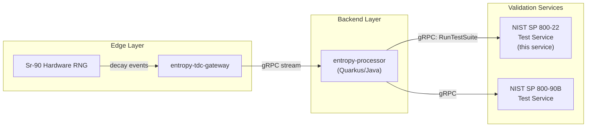
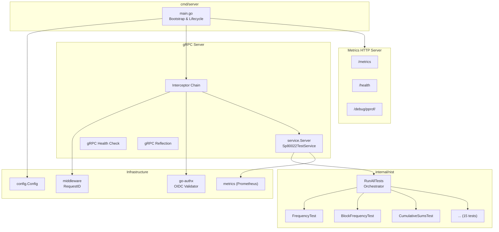
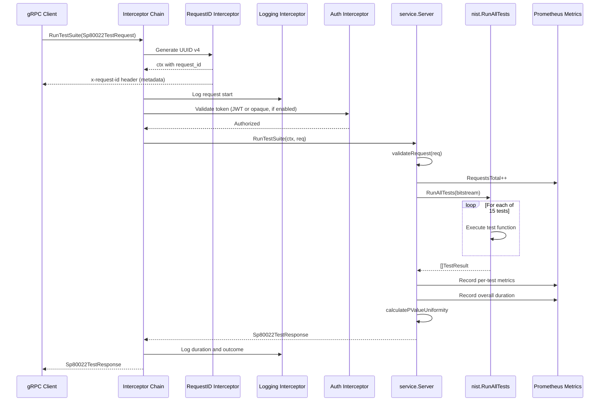
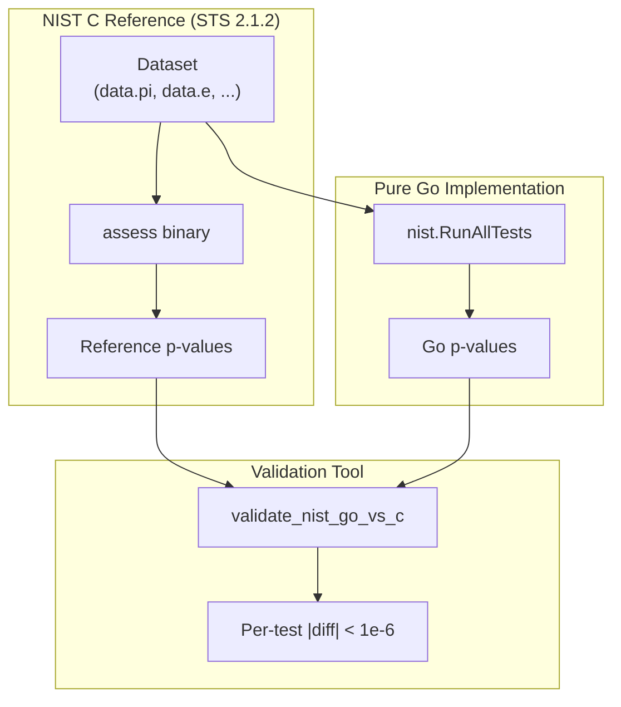
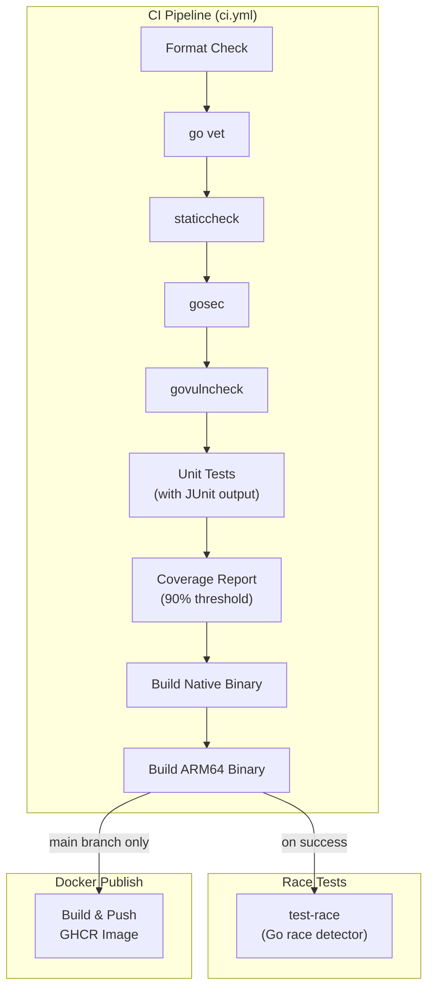

# Architecture: NIST SP 800-22 Rev 1a Statistical Test Service

## Table of Contents

1. [Overview](#1-overview)
2. [Role within the Decay-entropy-stream Platform](#2-role-within-the-decay-entropy-stream-platform)
3. [Project Structure](#3-project-structure)
4. [Component Architecture](#4-component-architecture)
5. [gRPC Service Interface](#5-grpc-service-interface)
6. [Statistical Test Engine](#6-statistical-test-engine)
7. [Request Processing Pipeline](#7-request-processing-pipeline)
8. [Configuration and Environment](#8-configuration-and-environment)
9. [Security Architecture](#9-security-architecture)
10. [Observability](#10-observability)
11. [Validation Strategy](#11-validation-strategy)
12. [Build, Packaging, and Deployment](#12-build-packaging-and-deployment)
13. [Continuous Integration and Delivery](#13-continuous-integration-and-delivery)

---

## 1. Overview

The NIST SP 800-22 Rev 1a Statistical Test Service is a pure-Go gRPC microservice that implements the complete suite of fifteen statistical randomness tests defined in NIST Special Publication 800-22, Revision 1a, titled "A Statistical Test Suite for Random and Pseudorandom Number Generators for Cryptographic Applications." The service accepts raw bitstreams via gRPC, executes all fifteen tests, and returns structured results including per-test p-values, pass/fail decisions at the standard significance level of 0.01, and an aggregate p-value uniformity assessment based on the chi-squared goodness-of-fit test.

The implementation is written entirely in Go without any CGO dependencies, enabling static compilation and straightforward cross-compilation for multiple target architectures including x86-64 and ARM64. It uses the Gonum numerical library for special mathematical functions such as the regularised incomplete gamma function and the Fast Fourier Transform, and has been validated to produce p-values numerically identical to those of the original NIST C reference implementation within floating-point epsilon tolerance.

The module name is `github.com/AmmannChristian/nist-sp800-22-rev1a` and requires Go 1.25.5 or later. The project is licensed under the MIT License.

## 2. Role within the Decay-entropy-stream  Platform

Within the broader decay-entropy-stream system, this service functions as one of two external NIST validation microservices consumed by the `entropy-processor` Quarkus/Java backend. The entropy-processor service communicates with this service over gRPC using a shared Protocol Buffers contract defined in the `nist.sp800_22.v1` package.

The overall data flow is as follows: a hardware random number generator based on Strontium-90 radioactive decay produces entropy events that are collected by the edge gateway (`entropy-tdc-gateway`). After whitening and conditioning, the bitstream data is forwarded to the entropy-processor backend. When NIST SP 800-22 validation is required, the backend serialises the bitstream into a gRPC request and forwards it to this service for statistical analysis. The service returns the complete test results, which the backend persists and exposes through its REST API.



The proto contract is maintained in two locations. The authoritative Go-side definition resides at `api/nist/v1/nist_sp800_22.proto` within this service, and a mirrored Java-side definition with additional Java-specific options resides at `entropy-processor/src/main/proto/nist_sp800_22.proto`. Both files share identical message and service definitions in the `nist.sp800_22.v1` package, differing only in language-specific code generation options (`go_package` versus `java_package`, `java_multiple_files`, and `java_outer_classname`).

## 3. Project Structure

The project follows the standard Go project layout with `cmd/` for application entry points, `internal/` for private packages, `pkg/` for generated code exposed to consumers, and `api/` for interface definitions.

```
nist-sp-800-22-go/
├── api/nist/v1/                    # Protobuf service and message definitions
│   └── nist_sp800_22.proto
├── cmd/server/                     # Application entry point
│   └── main.go
├── internal/                       # Private implementation packages
│   ├── config/                     # Environment-based configuration
│   │   └── config.go
│   ├── metrics/                    # Prometheus metric definitions
│   │   └── prometheus.go
│   ├── middleware/                  # gRPC interceptors
│   │   └── request_id.go
│   ├── nist/                       # Statistical test implementations
│   │   ├── common.go              # Shared utilities (bit extraction, psi-squared)
│   │   ├── run_all.go             # Test orchestration
│   │   ├── frequency.go           # Frequency (Monobit) Test
│   │   ├── block_frequency.go     # Block Frequency Test
│   │   ├── cumulative_sums.go     # Cumulative Sums Test
│   │   ├── runs.go                # Runs Test
│   │   ├── longest_run.go         # Longest Run of Ones Test
│   │   ├── binary_matrix_rank.go  # Binary Matrix Rank Test
│   │   ├── dft.go                 # Discrete Fourier Transform Test
│   │   ├── non_overlapping_template.go  # Non-Overlapping Template Test
│   │   ├── overlapping_template.go      # Overlapping Template Test
│   │   ├── universal.go           # Universal Statistical Test
│   │   ├── approximate_entropy.go # Approximate Entropy Test
│   │   ├── random_excursions.go   # Random Excursions Test
│   │   ├── random_excursions_variant.go # Random Excursions Variant Test
│   │   ├── serial.go             # Serial Test
│   │   └── linear_complexity.go   # Linear Complexity Test
│   └── service/                    # gRPC service handler
│       └── service.go
├── pkg/pb/                         # Generated protobuf Go code
├── tools/                          # Development and validation tooling
│   ├── tools.go                   # Build-tag pinned tool dependencies
│   ├── validate_nist_go_vs_c.go   # Go-vs-C reference comparison tool
│   ├── run_nist_validation.sh     # End-to-end validation script
│   └── ci/
│       └── .gosec.json            # Security scanner configuration
├── testdata/                       # NIST reference datasets
├── .github/workflows/              # CI/CD pipeline definitions
│   ├── ci.yml                     # Continuous integration workflow
│   └── nist-validation.yml        # Scientific validation workflow
├── Dockerfile                      # Multi-stage container build
├── docker-compose.yml              # Deployment composition
├── Makefile                        # Build automation
├── go.mod / go.sum                 # Go module definition
├── .env.example                    # Environment variable template
└── LICENSE                         # MIT License
```

## 4. Component Architecture

The service is organised into five principal components, each encapsulated within its own Go package under `internal/`. These components interact through well-defined interfaces and share no mutable state, enabling safe concurrent execution.



The following table summarises the responsibility of each component.

| Package | Responsibility |
|---|---|
| `cmd/server` | Application bootstrap, signal handling, graceful shutdown, gRPC server and HTTP metrics server lifecycle management |
| `internal/config` | Loading and validating configuration from environment variables with sensible defaults |
| `internal/metrics` | Declaring and registering Prometheus counters, histograms, and gauges for test execution telemetry |
| `internal/middleware` | gRPC unary interceptor for UUID-based request-ID generation and context propagation |
| `internal/nist` | Pure-Go implementations of all fifteen NIST SP 800-22 statistical tests and their orchestration |
| `internal/service` | gRPC service handler implementing `Sp80022TestService`, request validation, result assembly, and p-value uniformity computation |
| `pkg/pb` | Generated Go protobuf and gRPC stubs (not manually edited) |
| `tools` | Development-time tool dependency pinning, cross-implementation validation tooling, and CI helper scripts |

## 5. gRPC Service Interface

The service exposes a single gRPC service, `Sp80022TestService`, with one unary RPC method, `RunTestSuite`. The service is defined in Protocol Buffers version 3 within the `nist.sp800_22.v1` package.

### 5.1 Service Definition

```
service Sp80022TestService {
  rpc RunTestSuite(Sp80022TestRequest) returns (Sp80022TestResponse);
}
```

### 5.2 Request Message

The `Sp80022TestRequest` message contains a raw bitstream encoded as a `bytes` field and an optional configuration message that allows callers to override default test parameters.

| Field | Type | Description |
|---|---|---|
| `bitstream` | `bytes` | Raw bitstream to test. Must contain between 387,840 and 10,000,000 bits. |
| `config` | `optional Sp80022TestConfig` | Per-test parameter overrides. Default values follow NIST recommendations. |

The `Sp80022TestConfig` message exposes six configurable parameters, one for each test that accepts a block or sequence length. When omitted or set to zero, the service uses the NIST-recommended defaults: block frequency M=128, non-overlapping template m=9, overlapping template m=9, approximate entropy m=10, serial m=16, and linear complexity M=500.

### 5.3 Response Message

The `Sp80022TestResponse` message provides both individual test results and aggregate statistics.

| Field | Type | Description |
|---|---|---|
| `timestamp` | `string` | ISO 8601 timestamp of test execution |
| `sample_size_bits` | `int32` | Number of bits in the tested sample |
| `overall_pass_rate` | `double` | Fraction of executed tests that passed (0.0 to 1.0) |
| `p_value_uniformity_chi2` | `double` | Chi-squared p-value for uniformity of individual p-values |
| `results` | `repeated Sp80022TestResult` | Individual result for each of the fifteen tests |
| `execution_time_ms` | `int64` | Total execution time in milliseconds |
| `tests_run` | `int32` | Number of tests that produced valid results |
| `tests_skipped` | `int32` | Number of tests skipped due to insufficient data |
| `tests_total` | `int32` | Total number of tests in the suite (always 15) |
| `nist_compliant` | `bool` | True only when `tests_run` equals `tests_total` |

Each `Sp80022TestResult` contains the test name (snake_case identifier), p-value, pass/fail Boolean, an optional proportion field, and an optional warning string for diagnostic conditions.

### 5.4 Ancillary Services

In addition to the primary test service, the gRPC server registers two standard support services:

1. **gRPC Health Check** (`grpc.health.v1.Health`): Implements the standard gRPC health checking protocol. The serving status is set to `SERVING` upon successful startup. Health check methods are explicitly exempted from authentication.

2. **gRPC Server Reflection**: Enables runtime service discovery by gRPC clients and debugging tools such as `grpcurl`.

## 6. Statistical Test Engine

The `internal/nist` package contains the core statistical test implementations. Each test is implemented as an exported function that accepts a raw byte-slice bitstream and returns a p-value and a Boolean pass/fail decision at the significance level Alpha = 0.01.

### 6.1 Test Catalogue

The following table enumerates all fifteen tests, their corresponding function signatures, and the statistical method employed.

| No. | Test Name | Function | Method |
|---|---|---|---|
| 1 | Frequency (Monobit) | `FrequencyTest(bitstream)` | Complementary error function of normalised bit-sum deviation |
| 2 | Block Frequency | `BlockFrequencyTest(bitstream, M)` | Chi-squared test on per-block proportion deviations |
| 3 | Cumulative Sums | `CumulativeSumsTest(bitstream)` | Minimum p-value across forward and reverse random walk excursions |
| 4 | Runs | `RunsTest(bitstream)` | Complementary error function of run-count deviation from expected |
| 5 | Longest Run of Ones | `LongestRunOfOnesTest(bitstream)` | Chi-squared test on longest-run distribution across blocks |
| 6 | Binary Matrix Rank | `BinaryMatrixRankTest(bitstream)` | Chi-squared test on GF(2) rank distribution of 32x32 matrices |
| 7 | Discrete Fourier Transform | `DiscreteFourierTransformTest(bitstream)` | Spectral peak count deviation from expected 95th percentile threshold |
| 8 | Non-Overlapping Template | `NonOverlappingTemplateTest(bitstream, m)` | Chi-squared test across 148 templates (m=9), minimum p-value returned |
| 9 | Overlapping Template | `OverlappingTemplateTest(bitstream, m)` | Chi-squared test on overlapping match count distribution |
| 10 | Universal Statistical | `UniversalStatisticalTest(bitstream)` | Maurer's test comparing observed and expected per-block log-gap statistic |
| 11 | Approximate Entropy | `ApproximateEntropyTest(bitstream, m)` | Chi-squared test on entropy difference between block lengths m and m+1 |
| 12 | Random Excursions | `RandomExcursionsTest(bitstream)` | Chi-squared test on cycle visit counts for states in {-4,...,-1, 1,...,4} |
| 13 | Random Excursions Variant | `RandomExcursionsVariantTest(bitstream)` | Complementary error function on visit-count deviation for 18 states |
| 14 | Serial | `SerialTest(bitstream, m)` | Minimum of two regularised incomplete gamma p-values for overlapping m-bit patterns |
| 15 | Linear Complexity | `LinearComplexityTest(bitstream, M)` | Berlekamp-Massey linear complexity binned into chi-squared categories |

### 6.2 Orchestration

The `RunAllTests` function in `run_all.go` serves as the orchestration entry point. It validates that the bitstream length falls within the acceptable range (387,840 to 10,000,000 bits), then sequentially invokes each of the fifteen test functions with NIST-recommended default parameters. Each result is recorded as a `TestResult` struct containing the test name, p-value, pass/fail status, proportion, and an optional warning.

### 6.3 Shared Utilities

The `common.go` file provides helper functions used across multiple test implementations:

- **`bitAt`**: Extracts a single bit at a specified index from a byte slice in big-endian bit order using bitwise operations.
- **`expandBits`**: Converts a packed byte slice into an expanded slice of individual bits (each element being 0 or 1), which is the input format expected by most test functions.
- **`normal`**: Computes the cumulative distribution function of the standard normal distribution via the complementary error function.
- **`psi2`**: Computes the psi-squared statistic for a given block length using a binary-trie indexed frequency count, shared by the Serial and Approximate Entropy tests.

### 6.4 Mathematical Dependencies

The statistical computations rely on two primary external numerical resources:

1. **`gonum.org/v1/gonum/mathext`**: Provides `GammaIncRegComp`, the regularised upper incomplete gamma function, which is used to convert chi-squared statistics to p-values for tests including Block Frequency, Longest Run of Ones, Non-Overlapping Template, Overlapping Template, Approximate Entropy, Random Excursions, Serial, and Linear Complexity.

2. **`gonum.org/v1/gonum/dsp/fourier`**: Provides the FFT implementation used by the Discrete Fourier Transform test.

## 7. Request Processing Pipeline

The following sequence diagram illustrates the complete lifecycle of a `RunTestSuite` gRPC request from client to response.



### 7.1 Interceptor Chain

The gRPC server employs a chain of unary interceptors applied to every incoming request in the following order:

1. **Request-ID Interceptor** (`middleware.UnaryRequestIDInterceptor`): Generates a UUID v4, stores it in the request context, and propagates it to the client via the `x-request-id` gRPC response header.

2. **Logging Interceptor** (`loggingInterceptor`): Records the method name, request ID, wall-clock duration, and outcome (success or error) of every request using structured zerolog output.

3. **Authentication Interceptor** (conditional): When `AUTH_ENABLED=true`, an OAuth2/OIDC token validation interceptor from the `go-authx` library is appended. In `AUTH_TOKEN_TYPE=jwt` mode it validates bearer tokens against the configured issuer, audience, and JWKS endpoint. In `AUTH_TOKEN_TYPE=opaque` mode it validates opaque bearer tokens via RFC 7662 introspection (`AUTH_INTROSPECTION_URL` plus introspection client credentials). Health check endpoints are explicitly exempted from authentication.

### 7.2 Request Validation

The service layer validates each request against two constraints:

- **Minimum bits**: 387,840 (required by the Universal Statistical Test for L=6)
- **Maximum bits**: 10,000,000 (a safety cap to prevent excessive memory allocation)

Requests that violate these constraints are rejected with a descriptive error before any tests execute.

### 7.3 P-Value Uniformity Assessment

After all fifteen tests complete, the service performs a chi-squared goodness-of-fit test on the collected p-values to assess whether they are uniformly distributed over [0, 1], as required by NIST SP 800-22 for a truly random sequence. The p-values are binned into ten equal-width intervals, and the resulting chi-squared statistic is converted to a p-value using the regularised upper incomplete gamma function with nine degrees of freedom. This assessment requires at least five valid p-values; otherwise, the field is set to -1.0 to indicate insufficiency.

## 8. Configuration and Environment

All service configuration is loaded from environment variables by the `config.Load()` function in `internal/config/config.go`. Default values are provided for all parameters, enabling zero-configuration startup for development.

### 8.1 Configuration Parameters

| Variable | Type | Default | Description |
|---|---|---|---|
| `GRPC_PORT` | integer | 9090 | TCP port for the gRPC server |
| `METRICS_PORT` | integer | 9091 | TCP port for the HTTP metrics, health, and pprof server |
| `LOG_LEVEL` | string | `info` | Logging verbosity: `debug`, `info`, `warn`, or `error` |
| `AUTH_ENABLED` | boolean | `false` | Enable OAuth2/OIDC token validation for gRPC calls |
| `AUTH_ISSUER` | string | (empty) | Expected token issuer claim (required when auth is enabled) |
| `AUTH_AUDIENCE` | string | (empty) | Expected token audience claim (required when auth is enabled) |
| `AUTH_TOKEN_TYPE` | string | `jwt` | Token validation mode (`jwt` or `opaque`) |
| `AUTH_JWKS_URL` | string | (empty) | Custom JWKS endpoint URL (JWT mode; defaults to issuer well-known URL) |
| `AUTH_INTROSPECTION_URL` | string | (empty) | OAuth2 introspection endpoint URL (opaque mode) |
| `AUTH_INTROSPECTION_AUTH_METHOD` | string | `client_secret_basic` | Introspection client auth method (`client_secret_basic` or `private_key_jwt`) |
| `AUTH_INTROSPECTION_CLIENT_ID` | string | (empty) | Introspection client ID (`client_secret_basic`; optional for Zitadel key JSON with `private_key_jwt`) |
| `AUTH_INTROSPECTION_CLIENT_SECRET` | string | (empty) | Introspection client secret (`client_secret_basic`) |
| `AUTH_INTROSPECTION_PRIVATE_KEY` | string | (empty) | Introspection private key content for `private_key_jwt` (PEM, JWK JSON, or Zitadel key JSON) |
| `AUTH_INTROSPECTION_PRIVATE_KEY_FILE` | string | (empty) | File path alternative for `AUTH_INTROSPECTION_PRIVATE_KEY` |
| `AUTH_INTROSPECTION_PRIVATE_KEY_JWT_KID` | string | (empty) | Optional `kid` override for `private_key_jwt` assertions |
| `AUTH_INTROSPECTION_PRIVATE_KEY_JWT_ALG` | string | (empty) | Optional assertion signing algorithm (`RS256` or `ES256`) |
| `TLS_ENABLED` | boolean | `false` | Enable TLS for the gRPC server |
| `TLS_CERT_FILE` | string | (empty) | Path to the server TLS certificate (required when TLS is enabled) |
| `TLS_KEY_FILE` | string | (empty) | Path to the server TLS private key (required when TLS is enabled) |
| `TLS_CA_FILE` | string | (empty) | Path to CA certificate bundle for client certificate verification |
| `TLS_CLIENT_AUTH` | string | `none` | Client authentication mode (see Section 9.2) |
| `TLS_MIN_VERSION` | string | `1.2` | Minimum accepted TLS protocol version: `1.2` or `1.3` |

### 8.2 Validation Rules

Configuration validation is performed at startup and enforces the following constraints:

- Port numbers must be in the range 1 through 65535.
- Log level must be one of the four accepted values.
- When `AUTH_ENABLED=true`, both `AUTH_ISSUER` and `AUTH_AUDIENCE` must be non-empty.
- `AUTH_TOKEN_TYPE` must be either `jwt` or `opaque`.
- When `AUTH_TOKEN_TYPE=opaque`, `AUTH_INTROSPECTION_URL` must be non-empty.
- `AUTH_INTROSPECTION_AUTH_METHOD` must be either `client_secret_basic` or `private_key_jwt`.
- With `AUTH_INTROSPECTION_AUTH_METHOD=client_secret_basic`, both `AUTH_INTROSPECTION_CLIENT_ID` and `AUTH_INTROSPECTION_CLIENT_SECRET` must be non-empty.
- With `AUTH_INTROSPECTION_AUTH_METHOD=private_key_jwt`, `AUTH_INTROSPECTION_PRIVATE_KEY` or `AUTH_INTROSPECTION_PRIVATE_KEY_FILE` is required (mutually exclusive), file content must be non-empty, and `AUTH_INTROSPECTION_PRIVATE_KEY_JWT_ALG` must be `RS256` or `ES256` if provided.
- When `TLS_ENABLED=true`, both `TLS_CERT_FILE` and `TLS_KEY_FILE` must be specified, and `TLS_CLIENT_AUTH` and `TLS_MIN_VERSION` must parse to valid values.

If any validation rule is violated, the service terminates with a descriptive error message.

## 9. Security Architecture

### 9.1 Authentication

The service supports OAuth2/OIDC bearer token validation through the `go-authx` library (`github.com/AmmannChristian/go-authx`). When enabled, every gRPC request must include a valid bearer token in the request metadata. In JWT mode, the validator verifies the token signature against JWKS and checks issuer and audience claims. In opaque mode, it performs RFC 7662 introspection against the configured introspection endpoint. Introspection client authentication supports both `client_secret_basic` and RFC 7523 `private_key_jwt` (PEM/JWK/Zitadel key JSON).

Health check endpoints (`/grpc.health.v1.Health/Check` and `/grpc.health.v1.Health/Watch`) are explicitly exempted from authentication to allow infrastructure health monitoring without credentials.

### 9.2 Transport Layer Security

The service supports TLS encryption for the gRPC server with configurable client authentication modes:

| Mode | Constant | Description |
|---|---|---|
| `none` | `tls.NoClientCert` | No client certificate required (default) |
| `request` | `tls.RequestClientCert` | Client certificate requested but not required |
| `requireany` | `tls.RequireAnyClientCert` | Client must present a certificate (not verified) |
| `verifyifgiven` | `tls.VerifyClientCertIfGiven` | Verify client certificate only if presented |
| `requireandverify` / `mtls` | `tls.RequireAndVerifyClientCert` | Full mutual TLS with certificate verification |

The minimum TLS version defaults to TLS 1.2, with TLS 1.3 available as an option. The TLS configuration is constructed through the `go-authx/grpcserver` package, which handles certificate loading and credential creation.

### 9.3 Container Security

The Dockerfile runs the service as a non-root user (`nist`, UID 1000) and builds a statically compiled binary with `CGO_ENABLED=0`. The runtime image is based on Alpine Linux with only `ca-certificates` and `libc6-compat` installed, minimising the attack surface.

## 10. Observability

### 10.1 Prometheus Metrics

The service exposes six Prometheus metric families via an HTTP endpoint at `/metrics` on the configured metrics port. All metrics are registered using `promauto` and are safe for concurrent access.

| Metric | Type | Labels | Description |
|---|---|---|---|
| `nist_tests_total` | Counter | `test`, `status` | Count of individual test executions, labelled by test name and outcome (`pass` or `fail`) |
| `nist_test_duration_seconds` | Histogram | `test` | Wall-clock duration of individual tests in seconds |
| `nist_overall_duration_seconds` | Histogram | (none) | Duration of the full fifteen-test suite in seconds |
| `nist_last_overall_pass_rate` | Gauge | (none) | Most recent overall pass rate (0.0 to 1.0) |
| `nist_p_value` | Gauge | `test` | Most recent p-value for each test |
| `nist_requests_total` | Counter | `method`, `status` | Count of gRPC requests, labelled by method and outcome (`success` or `error`) |

### 10.2 Health Endpoint

An HTTP health endpoint at `/health` returns a JSON object containing the service status and version string, enabling integration with container orchestration health checks.

### 10.3 Performance Profiling

The metrics HTTP server imports `net/http/pprof`, which registers profiling handlers at `/debug/pprof/`. Available profiles include CPU, heap, goroutine, threadcreate, block, mutex, and execution trace. This allows runtime performance analysis without rebuilding the service.

### 10.4 Structured Logging

The service uses `zerolog` for structured JSON logging with zero-allocation output. Every log entry associated with a gRPC request includes the `request_id` field for distributed trace correlation. The logging interceptor records the method name, duration, and outcome of each request.

### 10.5 Request Tracing

Each request is assigned a UUID v4 identifier that is:

- Stored in the Go context for access by downstream handlers
- Propagated to the client via the `x-request-id` gRPC response metadata header
- Included in all log entries associated with the request

This enables end-to-end request correlation across the distributed system.

## 11. Validation Strategy

The service employs a two-tier validation approach to ensure correctness of the statistical test implementations.

### 11.1 Unit Tests

The project maintains 95.4% code coverage with a 90% minimum threshold enforced in CI. The Makefile provides coverage targets with atomic coverage mode, per-package threshold enforcement, and HTML report generation.

### 11.2 Cross-Implementation Validation

A dedicated validation tool (`tools/validate_nist_go_vs_c.go`) compares p-values produced by the pure-Go implementation against reference p-values from the original NIST C reference implementation (STS 2.1.2). The tool:

1. Reads a binary or ASCII-encoded bitstream dataset
2. Runs each of the fifteen tests through the Go implementation
3. Parses reference p-values from the NIST C suite output directory
4. Computes absolute differences between Go and reference p-values
5. Reports pass/fail for each test against a configurable tolerance (default: 1e-6)

An accompanying shell script (`tools/run_nist_validation.sh`) automates the end-to-end process: it downloads and builds the NIST STS 2.1.2 suite if not already present, runs the C reference suite against the specified dataset, and invokes the Go comparison tool against the reference output.

### 11.3 Validated Datasets

The validation has been performed against six standard NIST datasets: `data.pi` (digits of pi), `data.e` (digits of Euler's number), `data.sqrt2`, `data.sqrt3`, `data.sha1`, and `data.bad_rng` (deliberately non-random data). All fifteen tests produce p-values within floating-point epsilon of the reference implementation across all datasets.



## 12. Build, Packaging, and Deployment

### 12.1 Build System

The project uses a comprehensive Makefile with the following principal targets:

| Target | Description |
|---|---|
| `make proto` | Generate Go protobuf and gRPC stubs from `api/nist/v1/nist_sp800_22.proto` |
| `make build` | Compile a statically linked binary for the host architecture |
| `make build-arm64` | Cross-compile for ARM64 (e.g., Raspberry Pi) |
| `make test` | Run all tests with shuffled ordering |
| `make test-race` | Run tests with the Go race detector enabled |
| `make coverage` | Generate coverage profile and enforce the 90% threshold |
| `make bench` | Run performance benchmarks for all test implementations |
| `make lint` | Execute staticcheck and go vet |
| `make gosec` | Run security analysis |
| `make govulncheck` | Check for known vulnerabilities in dependencies |
| `make fmt` | Format code with gofumpt, gofmt, and goimports |
| `make tools` | Install pinned development tool versions from go.mod |

Development tools are pinned in `tools/tools.go` using the canonical Go build-tag tools pattern, ensuring reproducible tool versions across development environments.

### 12.2 Docker Image

The Dockerfile implements a multi-stage build:

1. **Builder stage** (`golang:1.25-alpine`): Downloads dependencies, copies source, and compiles a statically linked binary with `CGO_ENABLED=0` and size-optimised linker flags (`-s -w`).
2. **Runtime stage** (`alpine:3.18`): Installs only `ca-certificates` and `libc6-compat`, creates a non-root user, copies the binary, and configures default environment variables for ports and log level.

The Docker Compose configuration defines the service with:

- Port mapping for gRPC (9090) and metrics (9091)
- Full environment variable passthrough for all configuration parameters
- HTTP-based health check against the `/health` endpoint
- Resource limits of 2 CPU cores and 512 MB memory
- Resource reservations of 0.5 CPU cores and 128 MB memory

### 12.3 Input Constraints

The service enforces the following constraints on input bitstreams:

| Constraint | Value | Rationale |
|---|---|---|
| Minimum bits | 387,840 | Required by the Universal Statistical Test (L=6, Q=640) |
| Maximum bits | 10,000,000 | Safety cap to prevent excessive memory allocation |
| Recommended | 1,000,000 | NIST-recommended sample size for optimal test reliability |

## 13. Continuous Integration and Delivery

The project maintains two GitHub Actions workflows that together ensure code quality and scientific correctness.

### 13.1 Continuous Integration Workflow

The `ci.yml` workflow executes on every push and pull request to the `main` branch. It comprises the following stages:



The pipeline enforces:

- Code formatting with gofumpt, gofmt, and goimports (fail on diff)
- Static analysis via go vet and staticcheck
- Security scanning via gosec and govulncheck
- Unit test execution with shuffled ordering
- Coverage gating at 90% minimum
- Binary compilation for both x86-64 and ARM64
- Race condition detection in a separate job
- Docker image publication to GitHub Container Registry on main branch pushes

### 13.2 Scientific Validation Workflow

The `nist-validation.yml` workflow is triggered manually and performs a full cross-implementation validation:

1. Downloads and compiles the NIST STS 2.1.2 C reference suite
2. Generates reference p-values across six standard datasets
3. Runs the Go implementation against each dataset
4. Compares p-values within the configured tolerance
5. Produces a validation report as a GitHub Actions step summary

This workflow provides scientific evidence that the pure-Go reimplementation produces numerically identical results to the authoritative NIST reference implementation.
